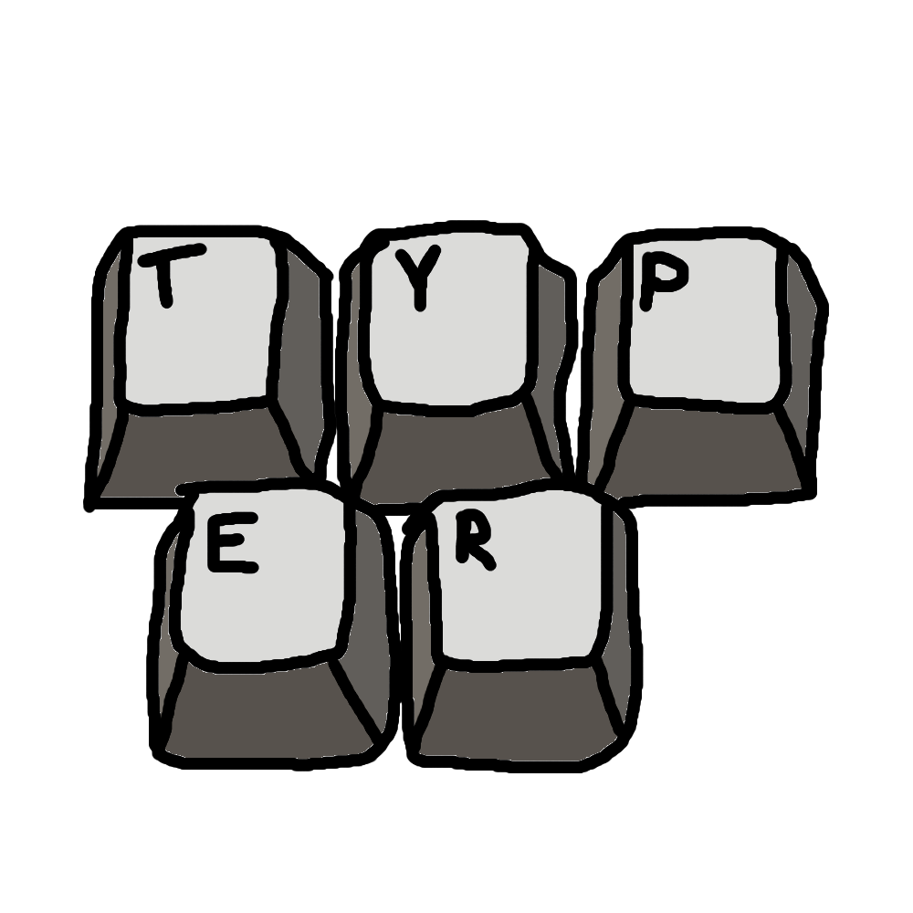
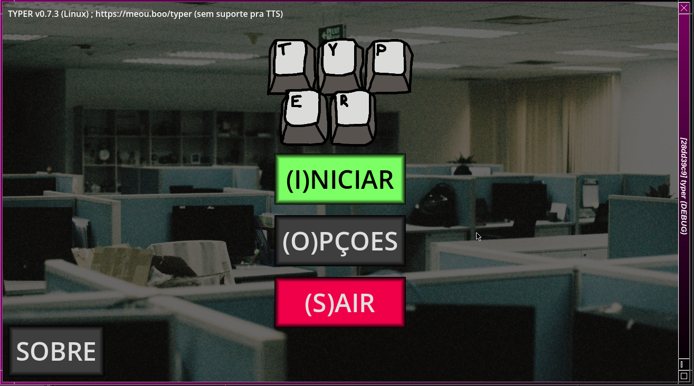
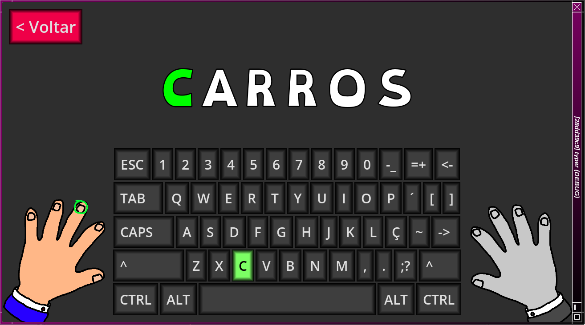

# Typer

## Introduction 

Typer is an educational game aimed at learning to type, with the idea of using your hands and fingers correctly. 

The game was created using Godot 4.7 for a university project and tested on people with intellectual disabilities. 

The idea is to bring a more educational and childish approach, different from a serious game or application considered as a "Typing Courses" like Klavaro (https://klavaro.sourceforge.io/en/index.html).

## Contributions and code analysis

Usage of generative ai is strictly forbidden, even for code analysis or debugging. This is a hobby project, created for fun.